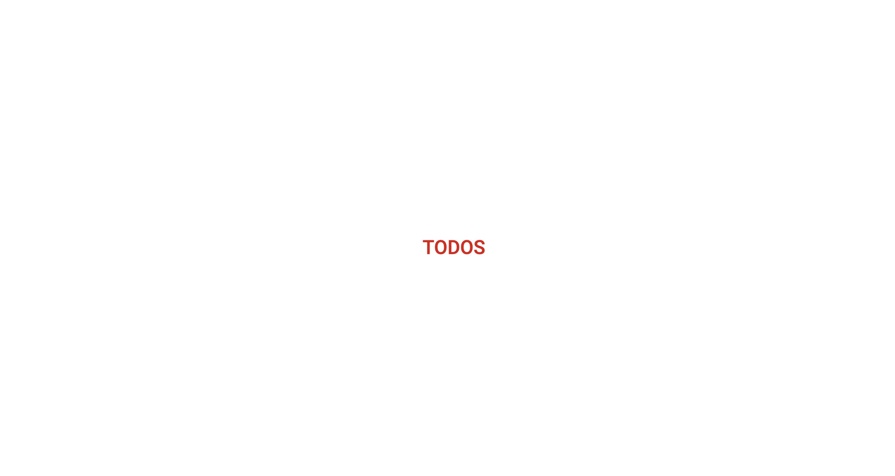

# Todos - простой планировщик задач

[Ссылка на приложение](https://todos.pavellbor.dev)

## Описание проекта

**Todos Fullstack** — это полнофункциональное приложение для управления задачами (To-Do List), разработанное с использованием `Node.js`, `Typescript` и `React`.

Основная цель проекта — предоставить пользователю удобный инструмент для создания, редактирования и удаления задач, а также управления их статусом (выполнена или не выполнена). Приложение поддерживает авторизацию и аутентификацию пользователей, что позволяет каждому пользователю иметь свой собственный список задач.

**Ключевые возможности:**

1. Создание и удаление задач.
2. Управление статусом задач (выполнена/не выполнена).
3. Фильтрация задач.
4. Авторизация и аутентификация для индивидуального списка задач.

## Демонстрация

[Ссылка на приложение](https://todos.pavellbor.dev)

## Стек технологий

Проект реализован с использованием следующих технологий:

### Frontend

- **React**: JavaScript библиотека для построения пользовательских интерфейсов.
- **TypeScript**: Строгая типизация для JavaScript, используемая для повышения надежности и удобства разработки.
- **Vite**: Современный инструмент сборки, обеспечивающий быструю разработку и сборку приложения.
- **Zustand**: Библиотека управления состоянием.
- **React Router**: Библиотека для маршрутизации в приложении.
- **Axios**: Библиотека для выполнения HTTP-запросов.

### Backend

- **Node.js**: JavaScript runtime, работающий на сервере.
- **TypeScript**: Используется для повышения надежности и качества кода.
- **JWT (JSON Web Tokens)**: Технология для реализации безопасной аутентификации и авторизации пользователей.

## Мотивация

Я приступил к созданию данного приложения, чтобы познакомиться с архитектурным подходом `FSD` в его классическом варианте.

Чтобы усложнить задачу, я решил добавить в приложение возможность **авторизации**, как популярный бизнес-кейс. Не стал пользоваться готовыми решениями в виде `json-server`, поэтому написал бэкенд самостоятельно, используя чистый `Node.js`. На бэкенде использовал **модульную** архитектуру.

Когда работа над приложением была завершена (если такое бывает, конечно), я упаковал его в `Docker` и выгрузил на сервер.

В итоге получилось приложение, описание к которому вы сейчас читаете. А я в процессе решил много интересных архитектурных задач, ближе познакомился с бэкенд-разработкой и DevOps.

[Ссылка на приложение](https://todos.pavellbor.dev)

## Установка и запуск

1. Выполните команду `npm run install` для установки зависимостей.
2. Создайте `.env` файлы в директориях `backend` и `frontend`. Заполните их содержимым из файла `.env.example`, который уже есть в директориях.
3. Выполните команду `npm run dev` для запуска в режиме разработки или `npm run start` для сборки проекта и запуска в режиме `production`.

В файле `package.json` в секции `scripts` вы можете посмотреть остальные команды.

## Автор

[Павел Борисов](https://github.com/pavellbor)
